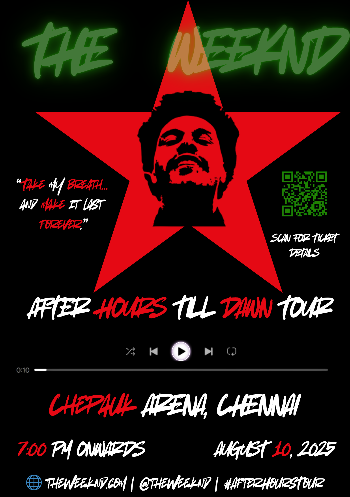

# OIBSIP_GraphicDesign_Tasks
Infographic Design for Internship

# Task 1 – Poster Design: The Weeknd Concert

## Objective:
To design a high-impact concert poster for The Weeknd’s "After Hours Till Dawn Tour" using strong contrast, bold imagery, and modern event branding.

## Tools Used:
- Canva (for design)
- Color Palette:
  - Background: #000000 (Black)
  - Accent Red: #FF0000
  - Glow Green: #4CAF50
  - White: #FFFFFF
  - Orange: #F57C00 (minor accents)

## Description:
The poster captures the energy and theme of a live music concert with The Weeknd as the main artist. A strong central red star, silhouette portrait, stylized typography, and a glowing neon title all work together to create a moody, cinematic vibe. The inclusion of a QR code makes it event-ready.

## 🔗 Design Link (Canva):
[Click here to view the design](https://www.canva.com/design/DAGq500SoSA/sse_jp84YUv4HkOKWl1gQw/edit?utm_content=DAGq500SoSA&utm_campaign=designshare&utm_medium=link2&utm_source=sharebutton)

## Output:

## Learnings:
- Use of glow and neon-like effects for emphasis
- Visual alignment with music industry poster standards
- Embedding modern assets (QR codes, icons, player bar)

# Task 2 – Logo Design for Velvet International (Figma)

## Objective:
To design a versatile, fashion-forward logo for Velvet International — a modern menswear brand — reflecting values of trust, boldness, and sophistication.

## Tools Used:
- Figma (vector logo design and exports)
- Color Palette:
  - Orange: `#F57C00` (Main brand color)
  - Black: `#000000` (Text/zipper/icon)
  - White: `#FFFFFF` (Alternate version background)

## Description:
The logo uses a zipper element to symbolize fashion and sleekness. The typeface is custom-styled to appear bold, futuristic, and instantly recognizable. Several logo variations were created to showcase versatility:
- Orange background with black zipper and white brand name
- Black background with orange brand text
- Pattern repeat logo for packaging and fabric
- Realistic usage on lifestyle imagery

These versions ensure adaptability across print, digital, merchandise, and web branding.

## Design Link (Figma):
[Click here to view the logo in Figma](https://www.figma.com/design/Sq5g92RPNoO2SvwWpuvGkH/VELVET-INTERNATIONAL-LOGO?node-id=0-1&t=4HxNgDKaqWV5zRQJ-1)

## Output:
- .png)
- .png)
- .png)
- .png)
- .png)
- .png)
- .png)

## Learnings:
- Created scalable vector logos with shape consistency
- Explored combination mark, symbol-only, and wordmark usage
- Developed consistent visual identity suitable for high-end fashion
- Used pattern-making for fabric/branding elements
- Applied logo on real-world mockups for brand validation

# Task 3 – Business Card Design for Velvet International (Figma)

## Objective:
To design a modern and stylish business card for Velvet International — a premium menswear brand — using brand-aligned visuals, a creative zipper motif, and clean layout hierarchy.

## Tools Used:
- Figma (Design, layout, export)
- Brand Elements:
  - Orange: #F57C00 (primary background color)
  - Black & White: For typography and iconography
  - Zipper pattern vector for theme identity

## Description:
The business card is built on a bold visual metaphor — a **zipper** — which aligns with the fashion brand identity of Velvet International. It features:
- Front Side: Personal identity (Edwin Mario – Product Manager), contact information, and icons
- Back Side: Bold brand name with pattern or lifestyle background
- Typography: Bold stencil-style typeface matching the logo
- Layout: Balanced composition, clear information hierarchy, and print-ready spacing

## Design Link (Figma):
[Click here to view the business card](https://www.figma.com/design/XynfqAnFUz0vuuXxBTZQ2W/BUISNESS-CARD?node-id=0-1&t=aolC3szc5ezNBTyE-1)

## Output:
- Front: 
- Back: 

## Learnings:
- Created a unique and on-brand card layout
- Used consistent visual language from logo to card
- Practiced icon placement and modern font pairings
- Designed for digital and print export using Figma’s frame setup

# Task 4 – Infographic: 5 Must-Have Wardrobe Essentials for Men (Canva)

## Objective:
To create a clean, visually engaging infographic that showcases 5 essential wardrobe items for modern men using hierarchy, icons, and balanced layout design.

## Tools Used:
- Canva (for design layout and export)
- Color Palette:
  - Background: #1f4c6f (deep navy blue)
  - Accent Color: #FDCB2F (warm yellow)
  - Supporting Colors: #FFFFFF (text), #000000 (outline), #DDDDDD

## Description:
This vertical infographic presents five wardrobe essentials — white shirt, dark denim jeans, white sneakers, lightweight jacket, and a tailored blazer. Each section is clearly segmented with headings, bullet points, supporting images, and consistent iconography. A final “Quick Styling Tips” block reinforces the content with practical advice for fashion-conscious men.

## Design Link (Canva):
[Click here to view the infographic](https://www.canva.com/design/DAGrQbMjhlE/2MXjAzAvBpZIPgkLNV5hNQ/edit?utm_content=DAGrQbMjhlE&utm_campaign=designshare&utm_medium=link2&utm_source=sharebutton)

## Output:

## Learnings:
- Applied visual hierarchy using font weights and positioning
- Used icons and outlined images for emphasis
- Learned layout spacing and flow for vertical scroll infographics
- Practiced content structuring with consistent alignment and sectioning
